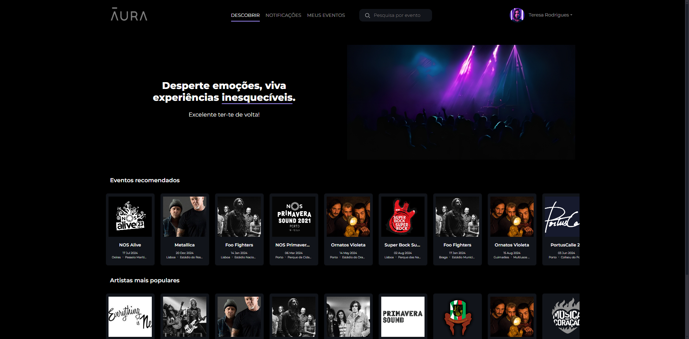
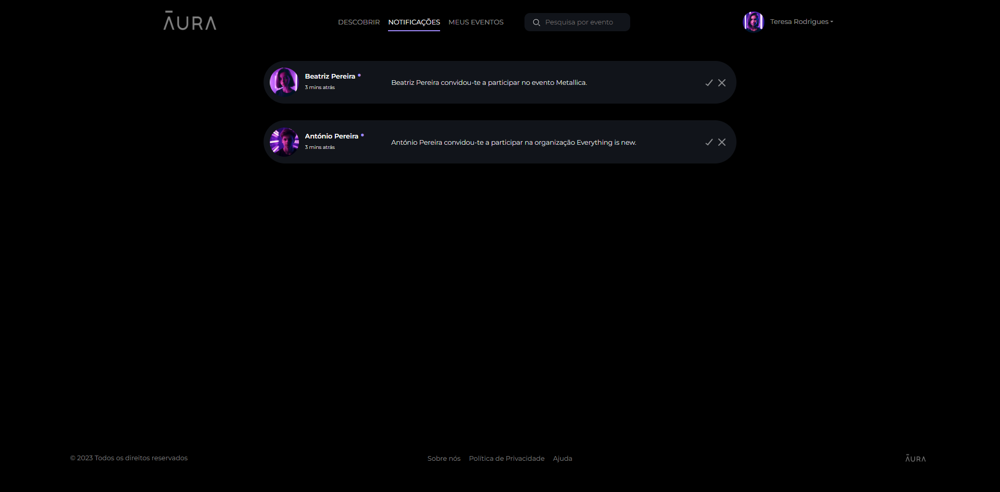
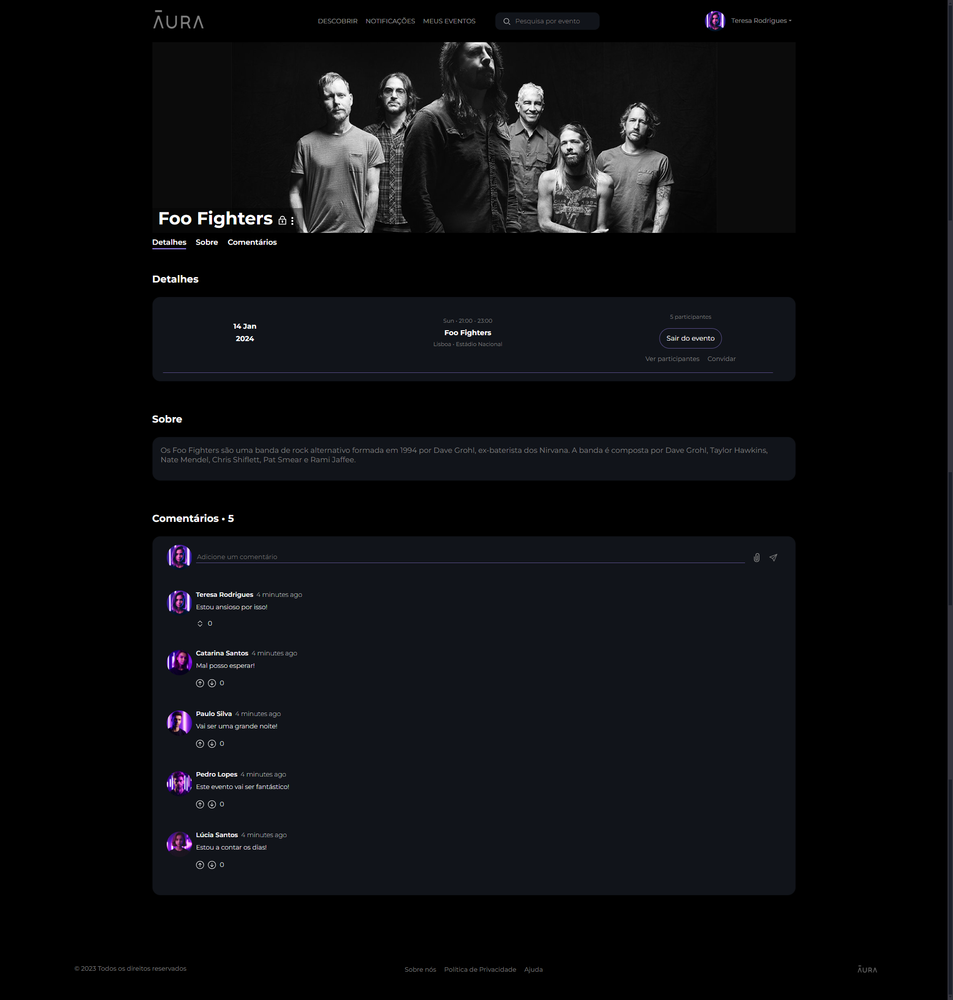

# Aura

Aura is a platform that centralizes music events across Portugal, connecting event organizers, attendees, and music enthusiasts. The platform enables users to discover, organize, and participate in concerts and festivals, with features for event joining, comments, invitations, and organizational management. [Presentation Video.](https://drive.google.com/file/d/1fB9fRRngFSSqxQv-8uwALCREm_zis6SY/view)






## Features

- **Event Creation and Management:** Organizers can easily create, edit, and manage events.
- **User Engagement:** Users can join events, comment, and invite others to participate.
- **Organization Support:** Users can join organizations to facilitate the creation of public or private events.
- **Search Functionality:** Discover events by date, location, or genre.

## Technologies Used

- **Backend:** Laravel
- **Frontend:** Bootstrap
- **Database:** PostgreSQL
- **Other Libraries:** SweetAlert2 for notifications and alerts

## Setup

To set up your environment for development, follow these steps:

### Prerequisites

1. Ensure your system has **PHP >= 8.1** and **Composer >= 2.2**.  
   We recommend using an **Ubuntu** distribution (e.g., Ubuntu 22.04 or newer). You can install the necessary packages by running:

   ```bash
   sudo apt update
   sudo apt install git composer php8.1 php8.1-mbstring php8.1-xml php8.1-pgsql php8.1-curl
   ```

2. Clone the repository and update dependencies:

   ```bash
   git clone https://github.com/Adriano-7/Aura
   cd aura
   composer update
   ```

   If Composer installation fails, ensure you’re using version 2 or above. If errors related to missing PHP extensions arise, verify and uncomment the required extensions in your [php.ini file](https://www.php.net/manual/en/configuration.file.php).

### Working with PostgreSQL

A Docker Compose file is included for running **PostgreSQL** and **pgAdmin4** in local Docker containers. From the project root, execute:

   ```bash
   docker compose up -d
   ```

To stop the containers:

   ```bash
   docker compose down
   ```

To access pgAdmin4, navigate to <http://localhost:4321> in your browser. For first-time setup, use these credentials:

- **Email:** `postgres@lbaw.com`
- **Password:** `pg!password`

Then, add the database connection in pgAdmin4 with the following details:

- **Hostname:** `postgres`
- **Username:** `postgres`
- **Password:** `pg!password`

### Database Setup

After setting up PostgreSQL, initialize the database and seed it with default data:

   ```bash
   php artisan db:seed
   ```

### Starting the Development Server

Run the following command to start the development server:

   ```bash
   php artisan serve
   ```

Access the application at `http://localhost:8000`. 

#### Admin Credentials

| Username | Password |
|----------|----------|
| admin@example.com | 1234 |

#### User Credentials

| Tipo | Username | Password |
|------|----------|----------|
| Conta Básica | catarina@example.com | 1234 |
| Organizador | antonio@example.com | 1234 |


To stop the server, press `Ctrl-C`.
