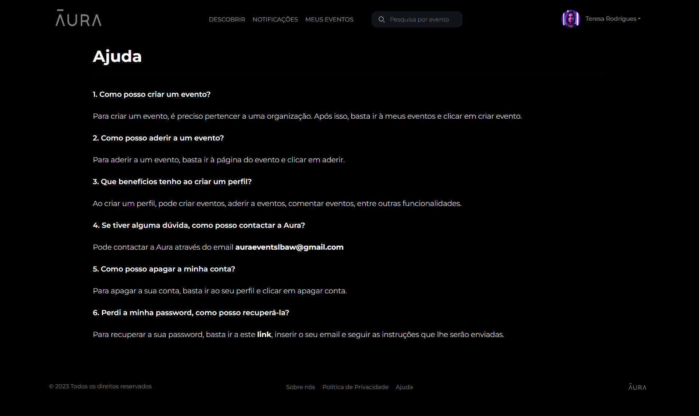
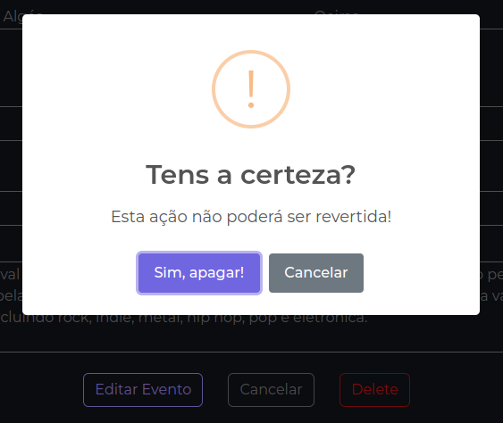

# PA: Product and Presentation

O projeto tem como objetivo criar uma plataforma online inovadora que reúna e promova concertos e festivais de música em Portugal. Esta plataforma será um ponto de encontro virtual para organizadores, participantes e entusiastas, proporcionando uma experiência única na descoberta, divulgação e participação nestes eventos em todo o país.

## A9: Produto

Aura é um projeto direcionado a organizadores e entusiastas de eventos musicais portugueses, tendo esta aplicação web o intuito de facilitar a organização e divulgação de eventos. Este produto permite aos utilizadores aderir a eventos, comentar, convidar outros utilizadores, entre outras funcionalidades. Além disso, os utilizadores podem-se juntar a organizações de forma a poder criar eventos públicos ou privados.

### 1\. Utilização

URL do produto: http://lbaw2384.lbaw.fe.up.pt

#### 1.1. Credenciais de Administrador

| Username | Password |
|----------|----------|
| admin@example.com | 1234 |

#### 1.2. Credenciais de Utilizador

| Tipo | Username | Password |
|------|----------|----------|
| Conta Básica | catarina@example.com | 1234 |
| Organizador | antonio@example.com | 1234 |

### 2\. Ajudas da aplicação

A aplicação tem uma página dedicada a ajuda, com possíveis questões a perguntas frequentes.



Ferramentas de ajuda foram implementadas na aplicação sob a forma de alertas, pedindo ao utilizador a confirmação de ações consideradas mais críticas.



Também utilizamos _pop-ups_ para indicar ao utilizador passos a seguir ou clarificar certas ações.


### 3\. Validação de Input

O input é validado tanto do lado do cliente como do lado do servidor.

Do lado do cliente temos como exemplo a edição de um comentário onde não permitimos ao utilizador a submissão de um comentário vazio, alertando o mesmo sobre esta situação. ([`event.js`](https://git.fe.up.pt/lbaw/lbaw2324/lbaw2384/-/blob/main/public/js/event.js#L478))

```js
document.addEventListener('submit', function (e) {
    if (e.target.matches('.edit-comment-form')) {
        e.preventDefault();

        let form = e.target;
        let formParams = new URLSearchParams(new FormData(form));
        let text = formParams.get('text');

        if (text.trim() === '') {
            alert('O comentário não pode estar vazio!');
        }

        updateComment(form);
    }
});
```

Do lado do servidor temos como exemplo a edição de um evento no [`EditEventController`](https://git.fe.up.pt/lbaw/lbaw2324/lbaw2384/-/blob/main/app/Http/Controllers/EditEventController.php#L50) onde validamos os campos do formulário em `$request->validate()` e de seguida validamos a data de início e fim tendo em conta o intervalo de tempo.

```php
    public function store(Request $request){
        if (!Auth::check()) {
            return abort(403, 'Utilizador não autenticado.');
        }
    
        $validatedData = $request->validate([
            'event_name' => 'required|max:255',
            'start_date' => 'required|date|after_or_equal:today',
            'start_time' => 'required|date_format:H:i',
            'end_date' => 'required|date',
            'end_time' => 'required|date_format:H:i',
            'event_address' => 'nullable|string|max:255',
            'event_city' => 'required|string|max:255',
            'event_venue' => 'required|string|max:255',
            'organization' => 'required',
            'event_visibility' => 'required',
            'event_description' => 'required|string',
        ]);
    
        $event = new Event;
        $event->name = $validatedData['event_name'];
        $start_date = $validatedData['start_date'];
        $start_time = $validatedData['start_time'];
        $start_datetime = new DateTime("{$start_date} {$start_time}");
        $event->start_date = $start_datetime;
    
        if ($validatedData['end_date'] && $validatedData['end_time']) {
            $end_date = $validatedData['end_date'];
            $end_time = $validatedData['end_time'];
            $end_datetime = new DateTime("{$end_date} {$end_time}");
            $event->end_date = $end_datetime;
    
            if ($end_datetime <= $start_datetime) {
                return redirect()->back()->withInput()->withErrors("A data de fim tem de ser posterior à data de início.");
            }
        } else {
            return redirect()->back()->withInput()->withErrors("Data de fim inválida.");
        }
    
        $event->address = $validatedData['event_address'];
        $event->city = $validatedData['event_city'];
        $event->venue = $validatedData['event_venue'];
        $event->organization_id = $validatedData['organization'];
        $event->is_public = $validatedData['event_visibility'] === 'public';
        $event->description = $validatedData['event_description'];
      
        $event->save();
    
        return redirect()->route('my-events')->with('success', 'Evento criado com sucesso');
    }
```

### 4\. Verificação de Acessibilidade e Usabilidade

- [Acessibilidade](https://git.fe.up.pt/lbaw/lbaw2324/lbaw2384/-/blob/main/artifacts/checklist_de_Acessibilidade.pdf)
- [Usabilidade](https://git.fe.up.pt/lbaw/lbaw2324/lbaw2384/-/blob/main/artifacts/checklist_de_Usabilidade.pdf)

### 5\. Validação de HTML & CSS

- HTML: [Página Inicial](https://git.fe.up.pt/lbaw/lbaw2324/lbaw2384/-/raw/main/artifacts/w3Validation\_-\_homepage.pdf?ref_type=heads), [Página de pesquisa](https://git.fe.up.pt/lbaw/lbaw2324/lbaw2384/-/raw/main/artifacts/w3Validation\_-\_search_page.pdf?ref_type=heads)
- CSS: [Página Inicial](https://git.fe.up.pt/lbaw/lbaw2324/lbaw2384/-/raw/main/artifacts/home.css_validation.pdf?ref_type=heads), [Página de pesquisa](https://git.fe.up.pt/lbaw/lbaw2324/lbaw2384/-/raw/main/artifacts/style.css_validation.pdf?ref_type=heads)

### 6\. Revsão ao projeto

- **ER:** Adicionada uma _business rule_ para que os eventos só possam ser criados por uma organização.
- **EBD:** Agrupamento das várias tabelas das notificações numa só, classificando as notificações com um `enum`. Adicionadas novas tabelas para implementar a recuperação de password e votações. Agrupamento das tabelas `Client` e `Admin` na tabela `User`, adicionando um novo parametro `is_admin` para diferenciar o tipo de utilizador. Adicionado um novo trigger para atualizar o balanço total de votos de um comentário aquando a inserção ou remoção de um voto.
- **EAP:** Certas rotas de navegação foram revistas e corrigidas para rotas mais corretas, tendo em conta o seu contexto. Adicionadas novas rotas para páginas estáticas e novas funcionalidades implementadas.

### 7\. Detalhes da Implementação

#### 7.1. Bibliotecas Usadas

As bibliotecas utilizadas foram:

- [Laravel](https://laravel.com)
- [Bootstrap](https://getbootstrap.com)
- [Sweet Alert2](https://sweetalert2.github.io)

#### 7.2 User Stories

| **ID** | **Nome** | **Prioridade** | **Team Members** | **State** |
|--------|----------|----------------|------------------|-----------|
| US01 | Navegação | Alta | **Adriano Machado**, Francisco da Ana, José Pedro Evans, Joaquim Cunha | 100% |
| US02 | Ver evento | Alta | **Francisco da Ana**, Adriano Machado | 100% |
| US03 | Tags | Alta | **Adriano Machado** | 100% |
| US04 | Pesquisa | Alta | **Adriano Machado** | 100% |
| US11 | Registo | Alta | **Adriano Machado**, Francisco da Ana, José Pedro Evans, , Joaquim Cunha | 100% |
| US12 | Login | Alta | **Francisco da Ana**, José Pedro Evans, Adriano Machado, Joaquim Cunha | 100% |
| US21 | Criar Eventos | Alta | **José Pedro Evans** | 100% |
| US22 | Convidar para Eventos | Alta | **Adriano Machado** | 100% |
| US23 | Gestão de Eventos Criados | Alta | **José Pedro Evans** | 100% |
| US24 | Gestão de Participação em Eventos | Alta | **Francisco da Ana**, Adriano Machado | 100% |
| US25 | Pedir para Participar em Eventos | Alta | **Francisco da Ana**, Adriano Machado | 100% |
| US26 | Logout | Alta | **Adriano Machado**, Francisco da Ana, José Pedro Evans | 100% |
| US27 | Adicionar Comentários | Alta | **Francisco da Ana**, Joaquim Cunha, Adriano Machado | 100% |
| US28 | Votar em Comentários | Alta | **Francisco da Ana** | 100% |
| US29 | Denunciar Eventos | Média | **Adriano Machado** | 100% |
| US210 | Apagar comentário | Média | **Francisco da Ana**, Adriano Machado, Joaquim Cunha | 100% |
| US211 | Receber convites para eventos | Baixa | **Adriano Machado** | 100% |
| US212 | Comprar bilhetes | Baixa | \- | 0% |
| US213 | Editar perfil | Baixa | **Francisco da Ana**, Adriano Machado | 100% |
| US214 | Editar comentário | Baixa | **Francisco da Ana** | 100% |
| US31 | Alterar detalhes do evento | Alta | **José Pedro Evans** | 100% |
| US32 | Adicionar organizador | Alta | **Adriano Machado** | 100% |
| US33 | Gerir lista de participantes | Alta | **Adriano Machado**, Francisco da Ana | 100% |
| US34 | Adicionar sondagens | Alta | **José Pedro Evans**, Adriano Machado | 100% |
| US35 | Cancelar evento | Alta | **José Pedro Evans**, Adriano Machado | 100% |
| US36 | Gerir visibilidade | Alta | **José Pedro Evans**, Adriano Machado | 100% |
| US37 | Criar eventos em nome de uma organização | Média | **José Pedro Evans** | 100% |
| US38 | Convidar participantes | Baixa | **Adriano Machado** | 100% |
| US41 | Ver Mensagens de Evento | Alta | **Francisco da Ana**, Joaquim Cunha | 100% |
| US42 | Responder a Votações | Alta | **José Pedro Evans**, Adriano Machado | 100% |
| US43 | Carregar Ficheiros | Alta | **Francisco da Ana** | 100% |
| US44 | Ver Lista de Participantes | Alta | **Adriano Machado** | 100% |
| US45 | Sair do Evento | Alta | **Francisco da Ana** | 100% |
| US46 | Receber notificações de eventos | Alta | **Adriano Machado** | 100% |
| US51 | Visualizar lista de eventos | Alta | **Adriano Machado** | 100% |
| US52 | Visualizar detalhes de um evento | Alta | **Francisco da Ana** | 100% |
| US53 | Visualizar denúncias de um evento | Alta | **Adriano Machado**, Joaquim Cunha | 100% |
| US54 | Apagar Eventos | Alta | **José Pedro Evans**, Adriano Machado, | 100% |
| US55 | Aceitar eventos de organizações | Alta | **Adriano Machado** | 100% |

---

## A8: Apresentação

### 1\. Apresentação do Produto

Aura é um projeto direcionado a organizadores e entusiastas de eventos musicais portugueses, tendo esta aplicação web o intuito de facilitar a organização e divulgação de eventos. Esta plataforma permite aos utilizadores executar um grande leque de funcionalidades como aderir a eventos, comentar, convidar outros utilizadores, responder a sondagens, e partilhar imagens, entre outros Além disso, os utilizadores podem-se juntar a organizações de forma a poder criar eventos públicos ou privados.

URL do produto: http://lbaw2384.lbaw.fe.up.pt

### 2\. Vídeo de Apresentação

[URL do vídeo](https://drive.google.com/file/d/1fB9fRRngFSSqxQv-8uwALCREm_zis6SY/view)

---

Grupo lbaw2384, 23/11/2023

* Adriano Machado, up202105352@up.pt
* Francisco Ana, up202108762@up.pt
* Joaquim Cunha, up202108779@up.pt (editor)
* José Pedro Evans, up202108818@up.pt